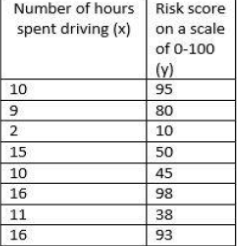
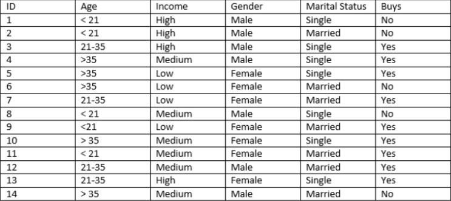
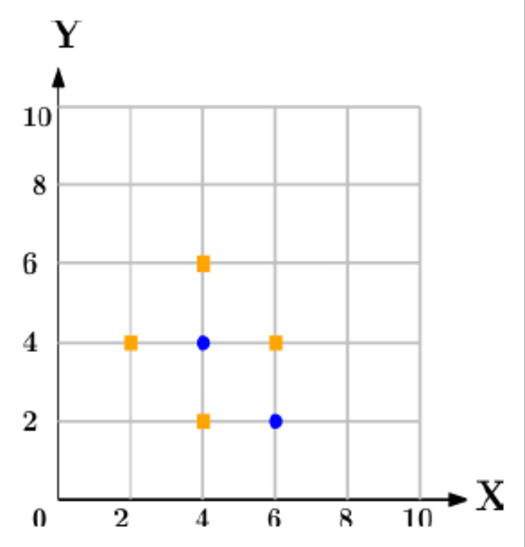

# Problem Statements

## 1. Assignment on Linear Regression:

The following table shows the results of a recently conducted study on the
correlation of the number of hours spent driving with the risk of developing acute
backache. Find the equation of the best fit line for this data.

## 2. Assignment on Decision Tree Classifier:

A dataset collected in a cosmetics shop showing details of customers and whether or
not they responded to a special offer to buy a new lip-stick is shown in table below.
Use this dataset to build a decision tree, with Buys as the target variable, to help in
buying lip-sticks in the future. Find the root node of decision tree. According to the
decision tree you have made from previous training data set, what is the decision for
the test data: [Age < 21, Income = Low, Gender = Female, Marital Status =
Married]?

## 3. Assignment on k-NN Classification:

In the following diagram let blue circles indicate positive examples and orange
squares indicate negative examples. We want to use k-NN algorithm for classifying
the points. If k=3, find the class of the point (6,6). Extend the same example for
Distance-Weighted k-NN and Locally weighted Averaging

## 4. Assignment on K-Means Clustering:

We have given a collection of 8 points. P1=[0.1,0.6] P2=[0.15,0.71] P3=[0.08,0.9]
P4=[0.16, 0.85] P5=[0.2,0.3] P6=[0.25,0.5] P7=[0.24,0.1] P8=[0.3,0.2]. Perform the
k-mean clustering with initial centroids as m1=P1=Cluster#1=C1 and
m2=P8=cluster#2=C2. 
Answer the following 
1] Which cluster does P6 belongs to? 
2] What is the population of cluster around m2? 
3] What is updated value of m1 and m2?

## 5. Assignment on SDES Algorithm(I)

Consider the 10 bit input key as: 1010000010, apply permuted choice 1, then circular
left shift and finally permuted choice 2 and generate 8 bit round keys for TWO
rounds

## 6. Assignment on SDES Algorithm(II)

The 8 bit input plain text is: **01110010**, Put the plain text into IP-8(initial
permutation) table, then perform Expansion and Permutation on right half. Use the
following TWO round keys K1 and K2 respectively and perform the XOR operation 
K1: 1 0 1 0 0 1 0 0 
K2: 0 1 0 0 0 0 1 1 
Show the result after second round.

## 7. Assignment on S-AES Algorithm

Consider the sub-key for round 0 is **Key0 = w0w1 = 0100 1010 1111 0101**. Take a 16-bit Plaintext as **P: 1101 0111 0010 1000**. Perform the add round 0 key operation, followed by Nibble substitution (S-Boxes), and finally display the output after shift row operation

## 8. Assignment on Diffie-Hellman key exchange Algorithm.

Assignment on Diffie-Hellman key exchange Algorithm. Implement the Diffie-Hellman key exchange Algorithm to generate the Shared Secrete Key. 
Assume following details. 
Prime Number q=11,  
Primitive root &alpha;=2, 
Sender side private key XA =8, 
Receiver side select private key XB =4.

## 9. Assignment on RSA Algorithm

Implement the RSA algorithm to generate the Cypher text.
Assume following details. 
Two prime number p=11, q=7, 
RSA Public Key=37, 
Plaintext= 15
